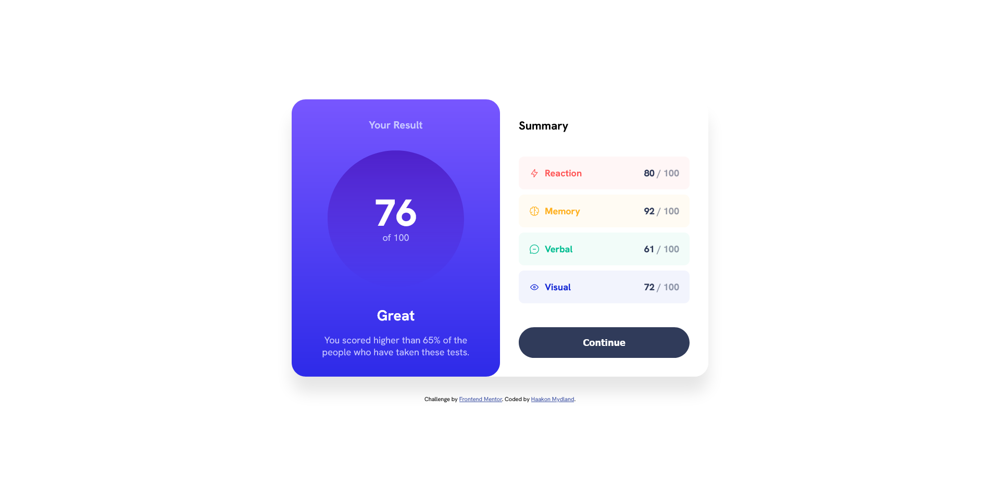
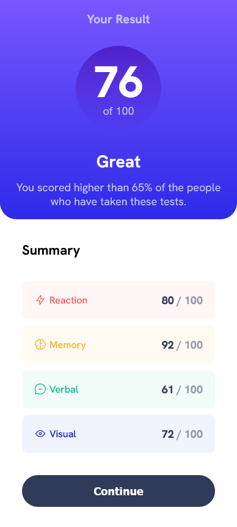

# Frontend Mentor - Results summary component solution

This is a solution to the [Results summary component challenge on Frontend Mentor](https://www.frontendmentor.io/challenges/results-summary-component-CE_K6s0maV). Frontend Mentor challenges help you improve your coding skills by building realistic projects.

I did this project one sunday afternoon, just to get into frontend mentor again. I can't be bothered writing about my process and thing like that today. Might update at some point.

## Table of contents

- [Overview](#overview)
  - [The challenge](#the-challenge)
  - [Screenshot](#screenshot)
  - [Links](#links)
- [My process](#my-process)
  - [Built with](#built-with)
- [Author](#author)

## Overview

### The challenge

Users should be able to:

- View the optimal layout for the interface depending on their device's screen size
- See hover and focus states for all interactive elements on the page

### Screenshot

### Links

- Solution URL: [/www.frontendmentor.io](https://www.frontendmentor.io/solutions/results-summary-component-react-ts-j3yRoSm7aE)
- Live Site URL: [www.results-summary-component-main-bqy.pages.dev](https://results-summary-component-main-bqy.pages.dev/)

## My process

### Built with

- Semantic HTML5 markup
- CSS custom properties
- Flexbox
- CSS Grid
- Mobile-first workflow
- [TypeScript](https://www.typescriptlang.org/)
- [React](https://reactjs.org/) - JS library

## Author

- Website - [Haakon Mydland](https://www.haakonmydland.com/home)
- Frontend Mentor - [@haakonmydland](https://www.frontendmentor.io/profile/haakonmydland)
- Twitter - [@haakonmydland](https://www.twitter.com/haakonmydland)
